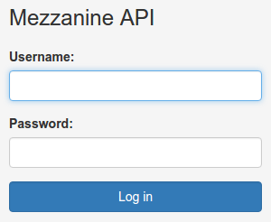
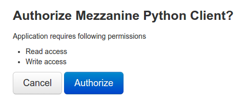

# Client SDK

Mezzanine Client is a **Python SDK** and **remote CLI** for [Mezzanine API](index.md). It enables a user or service to remotely read or write to Mezzanine CMS using Python or the command line. For example, you can write an article in Markdown on your laptop and type a simple command to automatically upload it and create a new blog post from it on your website.

This page concerns mainly the Python SDK part of the Mezzanine Client package. You can also refer to the [CLI page](cli.md) for information on the command line tool.

## Installation

    pip install -U mezzanine-client

[*Star* the Client on Github](https://github.com/gcushen/mezzanine-client-python/) to help support further development. You can also *watch* it on Github to keep track of updates.

## Prerequisites

Install [Mezzanine API](index.md#installation) either locally (for development) or remotely (for production), as we need an API to connect to.

Once Mezzanine API is installed,

1. Login to your Mezzanine CMS Admin Panel (e.g. [http://127.0.0.1:8000/admin/](http://127.0.0.1:8000/admin/))
2. In the menu, click *OAuth* > *Applications*
3. Create a new application with the following details:

        App Name: Mezzanine Python Client
        App ID: id
        App Secret: secret
        Client Type: Confidential
        Grant Type: Code
        Redirect URI: https://httpbin.org/get

For development purposes, you can define the simple app ID and secret above, otherwise use the automatically generated ones.

## Getting started

The client's `Mezzanine` class in the `api` module contains a set of methods for accessing the API. Some of the most common methods are demonstrated in the following command line interface examples:

- `posts_list.py` List published blog posts
- `posts_retrieve.py <post_id>` Retrieve the specified blog post
- `posts_create.py` Create a new blog post

Start by downloading the examples included in <https://github.com/gcushen/mezzanine-client-python/archive/master.zip> , or directly with `wget`:

    $ mkdir mezzanine-client-examples && cd $_ && wget https://raw.githubusercontent.com/gcushen/mezzanine-client-python/master/examples/posts_list.py \
    https://raw.githubusercontent.com/gcushen/mezzanine-client-python/master/examples/posts_retrieve.py \
    https://raw.githubusercontent.com/gcushen/mezzanine-client-python/master/examples/posts_create.py

Allow examples to be executed without explicit `python` command:

    $ chmod u+x posts_*.py

Prior to running the examples, export your app ID and secret to your terminal environment:

    $ export MZN_ID='id'
    $ export MZN_SECRET='secret'

Then run an example:

    $ ./posts_list.py

## Authorize the app

If you have previously used apps for platforms like Facebook, Google, or Twitter, then you may be familiar with the OAuth app authorization process. More specifically, the Mezzanine Client uses the latest OAuth2 code authorization flow.

The first time that the Client app attempts to access the API, it will ask you to click a link to authorize it. First you will be taken to the login page on your API website, where you should login using your Mezzanine account:

Next, you will be asked if you wish to authorize the Mezzanine Client app:

If you confirm the authorization request, you will be given a confirmation code, displayed similar to that below.

    "args": {
        "code": "vYQqcQSHmqkezX09xh8qflGVYUw6F8",
        "state": "Euf91j3H6uEE9VQ9mWsvFC5s3eEMJt"
    },

The confirmation code in this case is "vYQqcQSHmqkezX09xh8qflGVYUw6F8" *without* the speech marks and should be pasted back into the app within one hour to complete the authorization.

After successful authentication, Mezzanine Client stores the OAuth refresh token in `~/.mezzanine.cfg` to prevent you needing to manually re-authenticate every time you run the app. If you wish to completely logout of the app, you can delete this file.

Now you can have fun trying some of the CLI or SDK examples!

Otherwise, if there were any issues authorizing the app, it is worth checking that you followed all the [prerequisite](#prerequisites) steps. Or for help, refer to the [Community](#community) section below.

## Community

[Chat Room](https://gitter.im/gcushen/mezzanine-api?utm_source=badge&utm_medium=badge&utm_campaign=pr-badge) - if the room is quiet, feel free to leave a message and someone will try to get back to you.

[Report a bug or feature request](https://github.com/gcushen/mezzanine-client-python/issues) for the client.

## Roadmap

- Test suite
- Further documentation and examples
