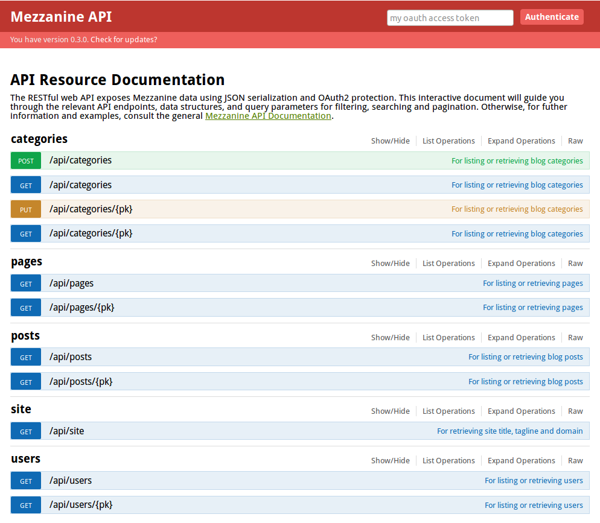
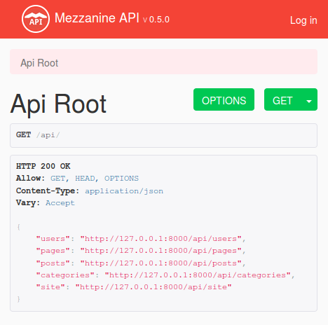
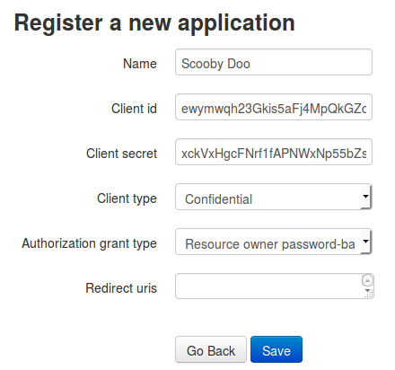

# Mezzanine API

RESTful API for Mezzanine CMS

---

## Overview

Mezzanine API is a **RESTful API** using **JSON** serialization and protected with **OAuth 2**. It is an extension 
for the [Mezzanine] content management platform, built using the [Django] framework. The API empowers developers to **automate, 
extend and combine Mezzanine with other services** such as Ember.js or a mobile app.

---

**Mezzanine API is in development.**

Check back regularly here and on [PyPi]/[Github] for updates to the documentation and package, respectively. 

Tell us what you need from the API so we can prioritize improvements. 

---

#### Access all the data your frontend needs

REST API resources for posts, categories, comments, pages, users, and public site data.

#### We care about security

That's why OAuth2 is utilized for authentication, allowing users to authorize and revoke access to third party 
applications without the need for those applications to request the user's confidential credentials. Member's only 
pages can only be accessed over the API if the requesting user is authenticated and has permission.

#### Filter and search results
Apply filters such as `posts?date_min=2015-01-01&category=2` or search `posts?search=fitness` to narrow down results. 
Results are paginated to handle large datasets.

#### Interactive endpoint documentation

The best way to learn about the API is via the interactive resource documentation which utilizes the popular [Swagger 
UI].

#### Easy to customize

The API leverages [Django Rest Framework] which has a large active community.

---

## Installation

In order to install Mezzanine API you'll need [Python] installed on your system, as well as the [Mezzanine] CMS.  

1. Install the `mezzanine-api` package using pip:

        $ pip install mezzanine-api

2. Add the following apps in this order to INSTALLED_APPS in your Mezzanine `settings.py`:

        INSTALLED_APPS = (
            ...
            'mezzanine_api',
            'rest_framework',
            'rest_framework_swagger',
            'oauth2_provider',
        )

3. Also, add the following lines at the end of your `settings.py` module:

        #####################
        # REST API SETTINGS #
        #####################
        try:
            from mezzanine_api.settings import *
        except ImportError as e:
            pass

4. Add the following code in your Mezzanine `urls.py` somewhere after the ``urlpatterns = []`` line:

        # REST API URLs
        urlpatterns += patterns("",
            ("^api/", include("mezzanine_api.urls")),
        )

5. Migrate the database to support OAuth2:

        $ python manage.py migrate

6. Start the server:

        $ python manage.py runserver

---

## Endpoint Resources

The best way to learn about the API resources is via the interactive resource documentation which utilizes the popular [Swagger 
UI]. Open up [http://127.0.0.1:8000/api/docs/](http://127.0.0.1:8000/api/docs/) in your browser, and you'll see the 
interactive endpoint resource documentation being displayed (refer to above screenshot). Here you can easily test out the 
different kinds of endpoint, method, and query parameter whilst you are learning.

Also, if you attempt to access the API itself directly in your browser, you will be shown a browsable web API:

Enjoy designing a frontend to interact with the REST API using your technology of choice! Alternatively, you can use it 
to automate, analyse, extend and combine Mezzanine with other services.

## Pagination

In order to handle large datasets, pagination is employed. To be consistent, all *listing* type endpoints 
provide a structure that allows for pagination. Please use a "page" parameter to fetch multiple pages of records. For
 example listing categories with `categories?page=2` will return a JSON structure similar to this:
 
    {
        "count": ...,
        "next": "http://127.0.0.1:8000/api/categories?page=3",
        "previous": "http://127.0.0.1:8000/api/categories",
        "results": [
            {
                ...
            }
        ]
    } 

## Permissions
Currently, the API is readonly with the exception of the `categories` resource. Categories may be created or updated 
over the API by a *superuser*. The rest of the API will also gradually be opened up for write access over forthcoming 
releases. This would allow you to make new blog posts, for example, using your own innovative frontend or web hooks.

Note that the `users` resource is provided so that you can carry out tasks such as retrieving the current user's 
details, view a blog post author's name, and list suggested usernames for predicted text entry. For privacy, the email 
field can only be accessed by the relevant owner or a *superuser*. However, the author's full name is accessible to all
by default (if provided) since blogs tend to operate on a real name basis. If you wish to customize this, take a look 
at the `UserSerializer` class.

## Authenticate with OAuth2

### Register

Open up [http://127.0.0.1:8000/api/oauth2/applications/register/](http://127.0.0.1:8000/api/oauth2/applications/register/) in your browser.

Go ahead and register a new OAuth application. Just enter a reference name, choose `confidential` client type and 
`...password-based` authorization grant type:

Request your access token to use for API authentication:

    $ curl -X POST -H "Accept: application/json; indent=4" \
      -d "grant_type=password&username=<username>&password=<password>" -u"<client_id>:<client_secret>" \
      http://localhost:8000/api/oauth2/token/

For `client_id` and `client_secret`, copy and paste those that you were given in the previous step. The `username` and 
`password` are the credentials of the Mezzanine user you wish to login as. You will get a JSON response like:

    {
        "access_token": "<your_access_token>",
        "token_type": "Bearer",
        "expires_in": 36000,
        "refresh_token": "<your_refresh_token>",
        "scope": "read write groups"
    }

### Test

The following test should *fail* (i.e. no user listings shown) if you are not currently authenticated:

    $ curl http://localhost:8000/api/users

    {
        "detail": "Authentication credentials were not provided."
    }

The following authenticated test should *succeed* and show you a list of users if you registered OAuth with a 
*superuser* account:    

    $ curl -H "Authorization: Bearer <your_access_token>" http://localhost:8000/api/users

You can also test your access token by entering it at the top of your interactive 
[API Resource Documentation](http://127.0.0.1:8000/api/docs/) page.

## Getting help
If you have questions about the API, consider using the [Mezzanine discussion group].

Otherwise, if you think you have found a bug, please use [GitHub issues] and include the steps necessary to reproduce
 it.

## Contributing
Mezzanine API is an open source project managed using the Git version control system. The repository is hosted
on [GitHub], so contributing is as easy as forking the project and committing back your enhancements.

## Roadmap
* Refinement
* Example API client
* Gradual roll-out of writeable API access
* Test Suite
* Further documentation
 

[Python]: https://www.python.org/
[Mezzanine]: http://mezzanine.jupo.org/
[Django]: http://djangoproject.com/
[GitHub issues]: https://github.com/gcushen/mezzanine-api/issues
[Swagger UI]: http://swagger.io/
[Mezzanine discussion group]: http://groups.google.com/group/mezzanine-users/topics
[Django Rest Framework]: http://www.django-rest-framework.org/
[PyPi]: https://pypi.python.org/pypi/mezzanine-api
[GitHub]: https://github.com/gcushen/mezzanine-api
